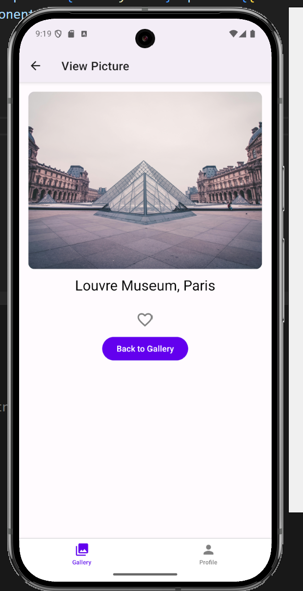
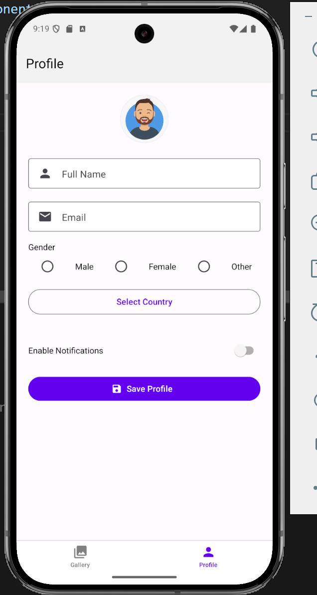
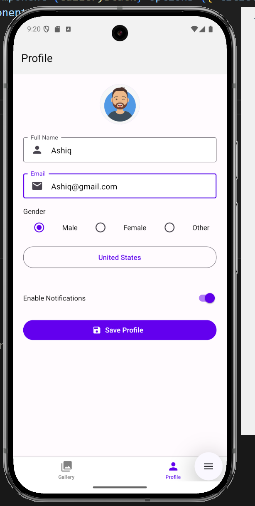
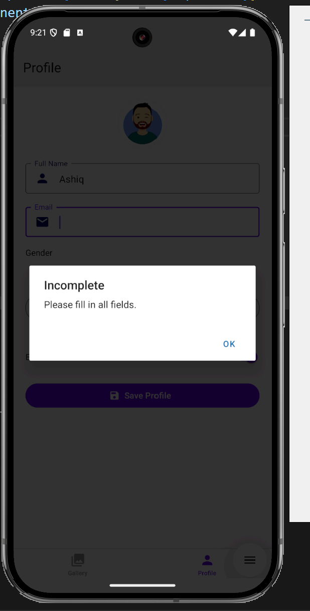

# Gallery Profile App (Made with React Native)

This is a mobile app made using **React Native**. It lets you look at a gallery of photos, view them in full screen, and also create and save your profile (name, email, etc.) which will stay saved even if you close the app.

---

## What This App Does

- Shows a list of pictures in a nice layout
- Lets you click on a picture to see it bigger
- Has a profile screen where you can enter your name, email, etc.
- You can favorite pictures and see just your favorites
- Saves everything on your phone so it stays even after closing the app

---

## Features

- Gallery screen with thumbnail photos and titles
- Full image viewer with a "favorite" heart button
- Profile screen with:
  - Text fields for name and email
  - Gender options using radio buttons
  - Country dropdown
  - Notifications toggle (on/off switch)
  - Save button that stores info permanently on your phone
- Uses popular UI components for a clean design

---

## Tools Used

- React Native (with Expo)
- React Navigation (to move between screens)
- React Native Paper (for buttons, text inputs, etc.)
- AsyncStorage (to save profile and favorites data)
- Expo Go app for testing

---

## Screens in the App

### 1. Gallery Screen
- Shows list of images
- Tap an image to see it bigger
- You can filter to show only favorite images

### 2. Picture Viewer Screen
- Shows full-size image and its title
- Lets you favorite or unfavorite the picture

### 3. Profile Screen
- Input name and email
- Choose gender
- Pick a country
- Turn on/off notifications
- Save your details — they stay saved even after closing the app

---

## Screenshots

### Gallery Screen

Shows thumbnails and a favorites toggle

### Picture Viewer Screen

Shows full-size image and favorite button

### Profile Screen

Shows inputs for name, email, gender, country

### Profile Details Saved

Shows profile values still saved after reopening the app

### Error Handling

Shows alert message if required fields are empty
---
