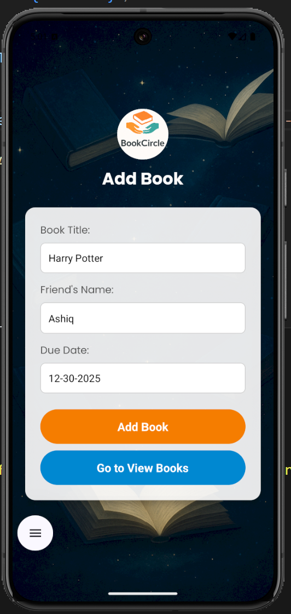
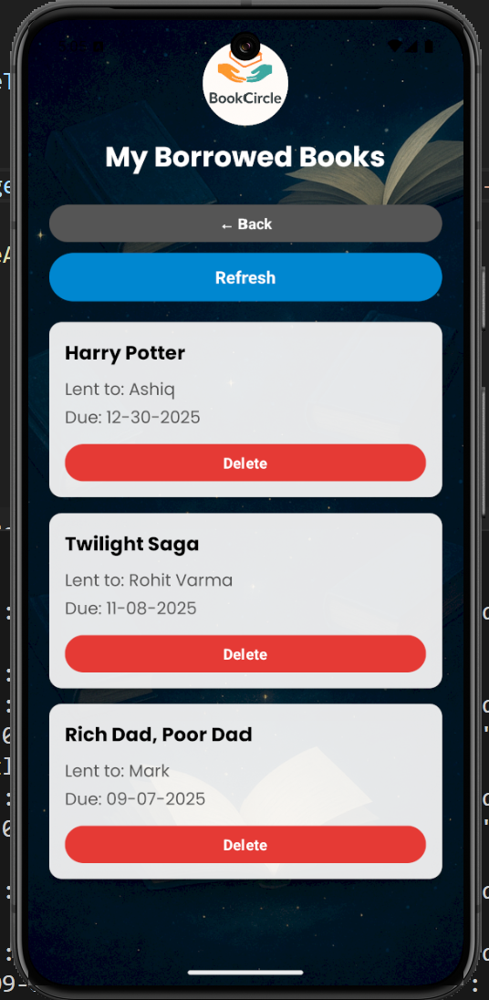
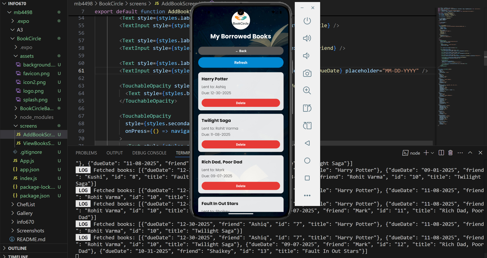
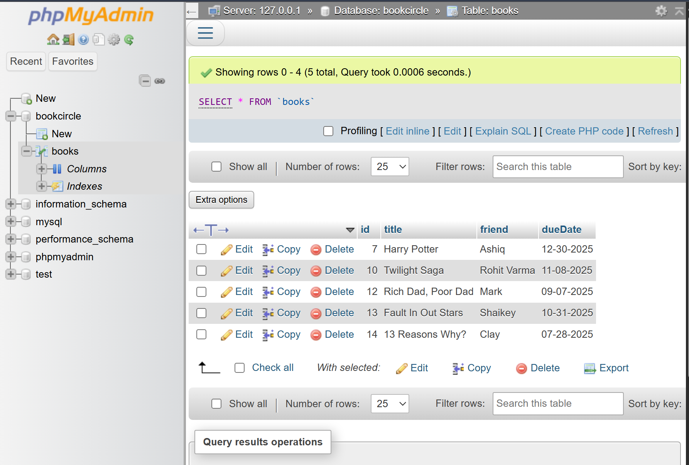
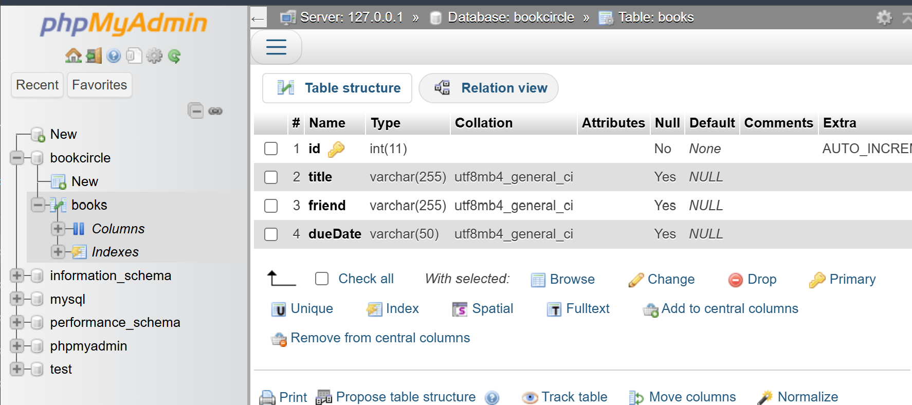
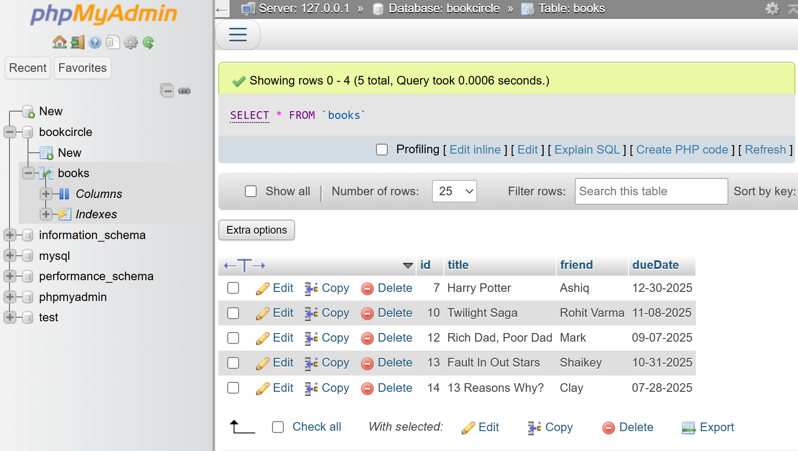
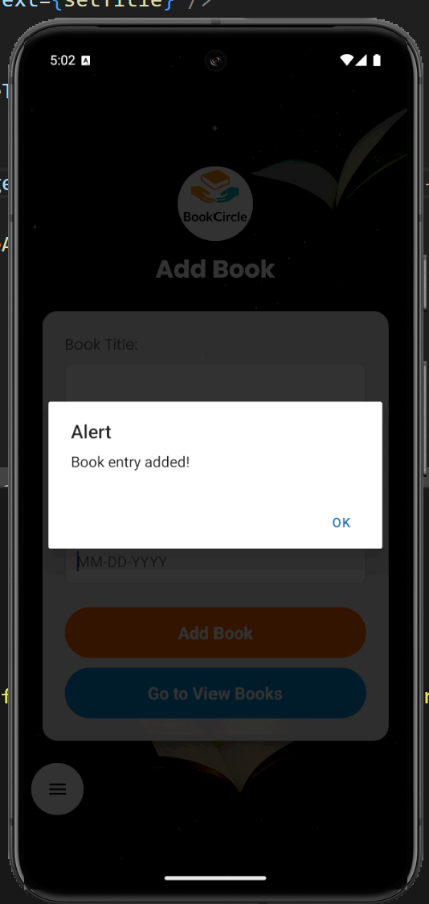
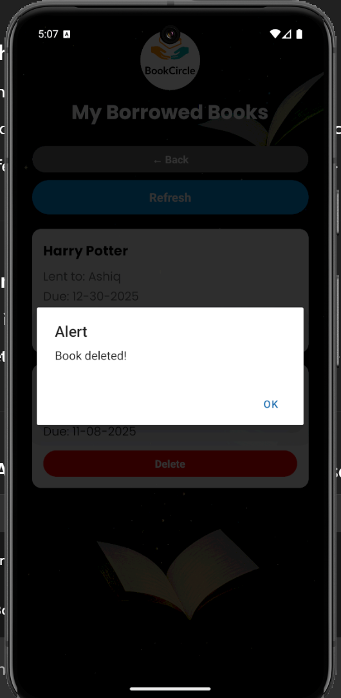

# BookCircle App

This is a mobile app made using **React Native**. It helps users keep track of books they have borrowed to friends — with due dates.  

You can add books, view the list of borrowed books, and delete them once they are returned.

The app also uses **PHP server APIs** and a **MySQL database** to store the book records.

---

## What This App Does

- Lets you add books you’ve lent out (title, friend’s name, due date)
- Shows a list of borrowed books
- Lets you delete a book when it’s returned
- Uses a MySQL database to save all book data
- Navigation between Add Book and View Books screens
- Custom splash screen and app logo
- Full-stack: React Native front-end + PHP APIs + MySQL backend

---

## Features

- Add Book Screen:
  - Enter book title
  - Enter friend’s name
  - Enter due date
  - Save the book to the server
- View Books Screen:
  - Shows list of borrowed books from server
  - Refresh button to reload data
  - Delete button to remove books
  - Back button to return to Add Book Screen
- Server APIs:
  - `addBook.php` to add books (POST)
  - `getBooks.php` to retrieve books (GET)
  - `deleteBook.php` to delete books (POST)
- Data stored in MySQL database

---

## Tools Used

- React Native (with Expo)
- React Navigation (Stack Navigator)
- Axios (to call APIs)
- PHP (server side)
- MySQL (database)
- phpMyAdmin (for database management)
- XAMPP (to run Apache and MySQL)

---

## Screens in the App

### Add Book Screen
- Lets user enter:
  - Book title
  - Friend’s name
  - Due date
- Press **Add Book** button to save the data
- Press **Go to View Books** to navigate to ViewBooksScreen

### View Books Screen
- Displays list of books from server
- Refresh button to reload the list
- Delete button to remove books
- Back button to return to Add Book Screen

### Navigation
- Implemented using React Navigation
- Seamless navigation between Add Book and View Books

---

## Screenshots

### Add Book Screen

---

### View Books Screen

---

### API - Get Books

---

### Database Table (Books)

---

### Database Schema

---

### SQL SELECT Query

---

### Book Added Alert

---

### Book Deleted Alert

---

## Folder Structure

BookCircleApp/ --> React Native App
└── App.js
└── screens/
├── AddBookScreen.js
├── ViewBooksScreen.js
└── assets/
├── background.png
├── logo.png
├── splash.png

BookCircleBackend/ --> PHP + MySQL backend
└── addBook.php
└── getBooks.php
└── deleteBook.php
└── create_table.sql